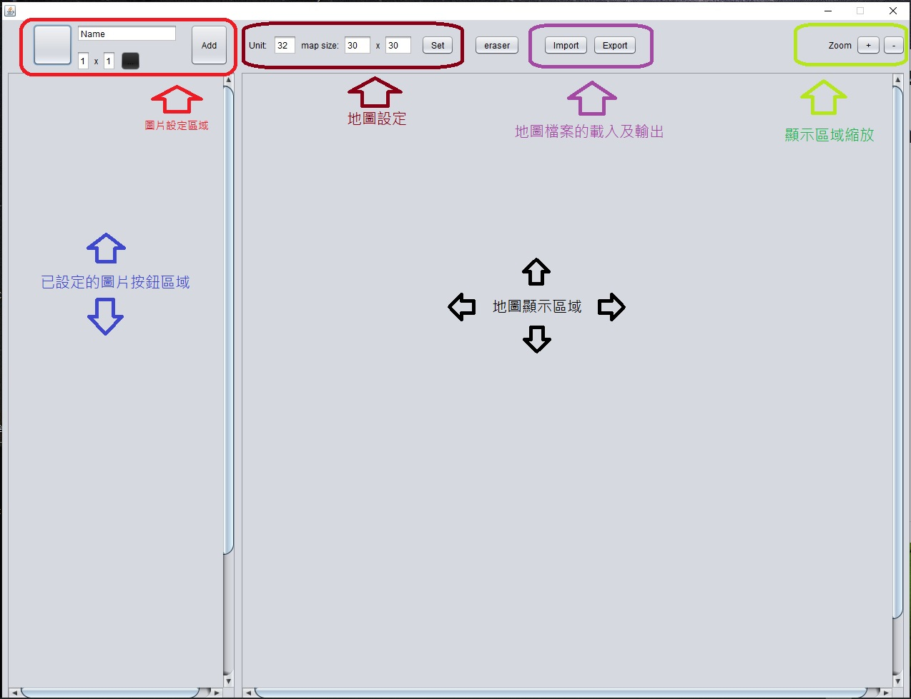
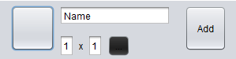
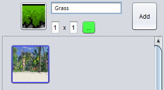
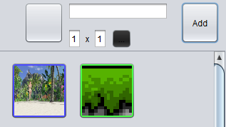
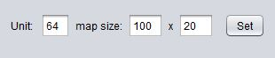
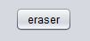
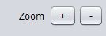
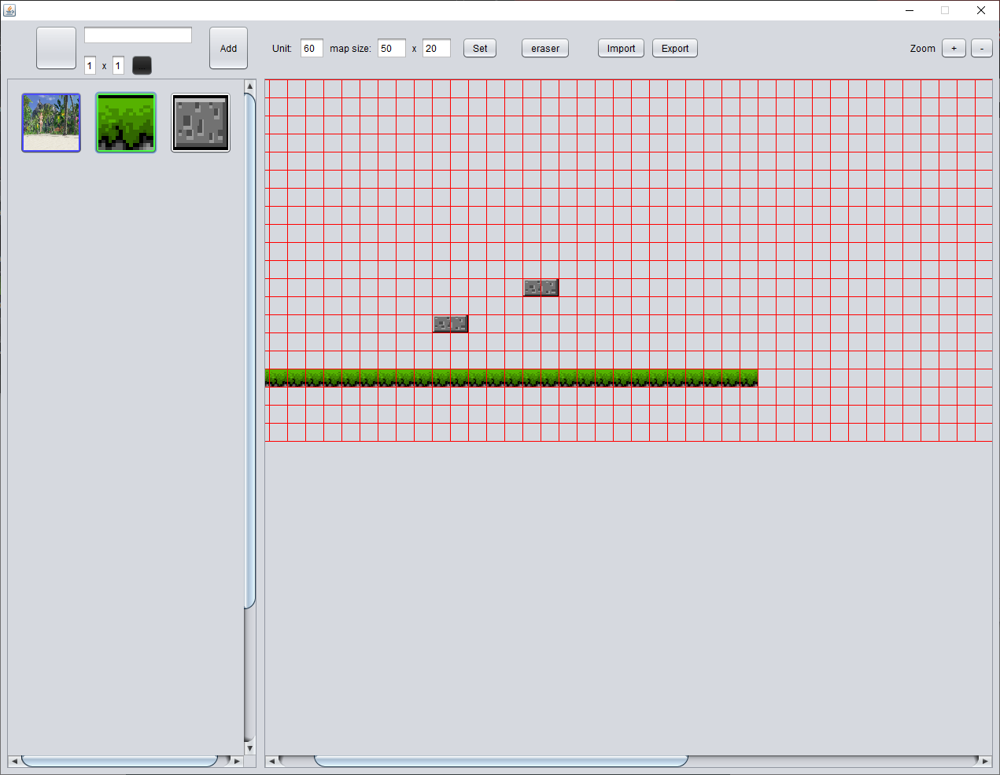

# Map Generator user menual

地圖產生器操作說明:

1. 畫面說明

   

2. 操作說明

   1. 物件編輯區域

      

      中間上方輸入對應圖形名稱，

      左方按鈕為圖示表示區，點選後跳出選擇視窗，選擇對應圖示，

      中間下方 設定在地圖上的 對應尺寸(格數)，

      中間小按鈕為設定地圖檔對應顏色，設定完成後，按下add按鈕，則下方物件區建立，如圖：

      

      

      

   2. 地圖參數設定

      

      此區域 設定每格的單位，以及地圖檔的長寬尺寸，設定後按下Set按鈕，

      在右方地圖顯示區域 會建立出對應區塊，提供編輯的對應。

      

   3. 地圖繪製方式

      點選左方已設定圖片，在地圖顯示區域點選後繪製，

      若需連續繪製，則按住滑鼠，拖曳路徑 連續繪製。

      

   4. 地圖清除編輯

      若繪製錯誤，可點選  ，在地圖編輯區域點選的地方便會清除繪製。

      

   5. 繪圖區域縮放

      可操作縮放按鈕  
      
      編輯畫面如下：
      
        
      
        縮放限制: 放大最大到Unit的1.5倍，最小則顯示10pixel，
      
        當縮到20pixel時，將繪製顏色替代圖案，如BMP輸出檔案畫面呈現。
      
      ​      

   6. 地圖檔案輸出

      若已完成地圖編輯，則點選 的Export，

      跳出資料夾選擇視窗，在選擇後，相會輸出genMap.bmp檔以及genMap.txt檔案，

      

   7. 地圖檔案載入

      若需編修地圖，則點選Import，

      跳出資料夾選擇視窗，選擇後，自動將對應名稱的兩個檔案讀入，

      重新回復物件按鈕，在操作地圖編輯畫面後，則會重新繪製原地圖檔資料。

      

   8. 操作注意事項

      - 編輯物件顏色不可設定為黑色

      - 編輯物件新增時，名稱、顏色、圖案若有一個相同，則無法增加編輯物件，請注意。

      - 地圖設定的set按下時，會清空地圖編輯區，並重新設定畫布，還請多加注意操作。

      - 若使用大於1x1的物件，繪製圖形的標示點為左上角，清除時須點擊左上位置。

      - 輸出檔案後，建議將地圖移出另存，目前有地圖檔存在時，輸出會覆蓋檔案，

        請更換儲存位置，或將原地圖進行搬移或刪除。

      - 輸入檔案時，需對應固定名稱，建議以資料夾命名進行地圖檔儲存，

        避免編輯資料遺失等風險。

        
